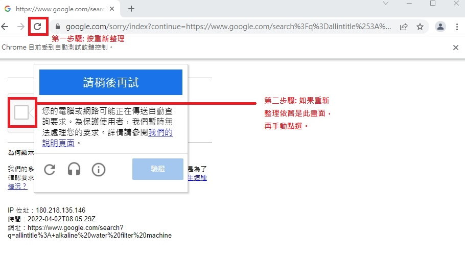

<h1 align="center">自動化SEO流量查詢系統</h1>
<div align="center">
  <a href="https://raw.githubusercontent.com/bruce601080102/seo_web_crawler">
    
  </a>
</div>

## 給做行銷人員的介紹

這是個自動化搜尋關鍵字流量的程式，已經`破解Google Recaptcha語音辨識`的部分，可以完全自動化採集關鍵字流量，以減少乏味的搜尋動作。根據統計，`Google伺服器每約80次短頻查詢，就會跳出驗證畫面`。
本專案針對於無程式經驗的行銷人員特此在下面篇幅中介紹如何執行，在不使用指令的方式下，執行本專案內容。

<a href="#執行方法">▶ 無程式經驗者請點我</a>

<a href="#部署說明">▶ 會Python使用者請點我</a>

## 專案特色

- [x] 無使用程式經驗者使用
- [x] 無須改code
- [x] 生成excel表
- [x] 自動化爬取
- [x] 破解Recaptcha
    - [x] 語音認證
    - [ ] 圖像認證

## 執行方法

### 方法一
- 滑鼠點選兩下main.exe檔，即可執行程式
### 方法二
- 開啟cmd，輸入python main.py(需要下載python環境，請觀看最下方說明) <a href="#部署說明">往下滑入</a>

## 文件配置
- 請將excel的檔名改為input.xlsx，記得是副檔名為xlsx，如果已是xlsx，將名稱改為input即可

- 請打開conf資料夾裡的env.cfg檔
  >  sheet_name: 為分頁名稱

  >  query_column_name: 需要查的欄位名稱(欄位B-1)
  
  >  normal_result_column: 一般查詢結果欄位名稱(欄位C-1)

## 注意事項
- 請與data資料夾中example裡的「「泓記實業有限公司V3.xlsx」複本.xlsx格式相同
- 此程式會開啟Chrome瀏覽器，開啟的瀏覽器請勿關閉，否則導致程式執行失敗\
- 請安裝Chrome瀏覽器
- 如果無法通過語音驗證，請轉到圖像驗證，並人工點選(如下圖範例)
<div align="center">
  <a href="https://raw.githubusercontent.com/bruce601080102/seo_web_crawler">
    
  </a>
</div>

## 下載vscode
**用途**
-  能夠編輯conf/env.cfg
    > 下載網址: https://code.visualstudio.com/

    > 將本專案資料拖曳至Visual Studio Code的圖標裡，即可開啟

****
## 部署說明
**環境依賴**
> python 3.7

**安裝包指令**
```sh
pip install PyAudio-0.2.11-cp37-cp37m-win_amd64.whl
pip install -r requirements.txt
```

**使用設定**

<a href="#文件配置">▶ 點我文件配置說明</a>

**執行指令**
```sh
python main.py
```

**打包指令**
```sh
pyinstaller -F main.py
```
****
## 作者
Bruce Tsai - bruce60108010204@gmail.com

專案位置: https://github.com/bruce601080102/seo_web_crawler
****
## 更新日誌
V1.0.0 版本 2022-03-26

    1.初始功能: 創建excel
    2.新功能: 連線爬取流量

V2.0.0 版本 2022-04-02

    1.新功能: 辨識Google Recaptch語音認證
    2.修復: 寫入excel輸入位置錯誤 
