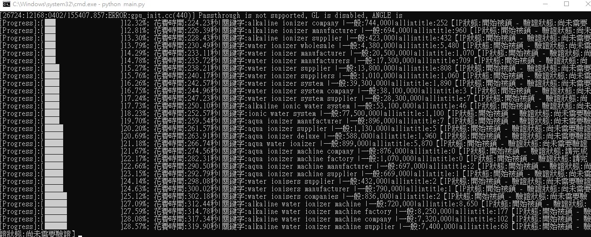

# 自動化SEO流量查詢系統
## 一、給做SEO行銷人員的介紹
這是個半自動化搜尋關鍵字流量的程式，可以自動化採集關鍵字流量，可以減少乏味的搜尋動作。根據統計，Google伺服器每約80次短頻查詢，就會跳出驗證畫面。

<div align="center">
  <a href="https://raw.githubusercontent.com/bruce601080102/seo_web_crawler">
    
  </a>
</div>
## 二、執行方法
### 方法一
- 滑鼠點選兩下main.exe檔，即可執行程式
### 方法二
- 開啟cmd，輸入python main.py(需要下載python環境，請觀看最下方說明)

## 三、文件配置
- 請將excel的檔名改為input.xlsx，記得是副檔名為xlsx，如果已是xlsx，將名稱改為input即可

- 請打開conf資料夾裡的env.cfg檔
  >  sheet_name: 為分頁名稱

  >  query_column_name: 需要查的欄位名稱(欄位B-1)
  
  >  normal_result_column: 一般查詢結果欄位名稱(欄位C-1)

## 四、注意事項
- 請與data資料夾中example裡的「「泓記實業有限公司V3.xlsx」複本.xlsx格式相同
- 此程式會開啟Chrome瀏覽器，開啟的瀏覽器請勿關閉，否則導致程式執行失敗\
- 請安裝Chrome瀏覽器
- 如果無法通過語音驗證，請轉到圖像驗證，並人工點選(如下圖範例)
<div align="center">
  <a href="https://raw.githubusercontent.com/bruce601080102/seo_web_crawler">
    
  </a>
</div>

## 五、下載vscode
- 下載網址: https://code.visualstudio.com/
- 將本專案資料拖曳至Visual Studio Code的圖標裡，即可開啟

****
## 上方點兩下失敗，請到此觀看

## 安裝教學網址
https://ithelp.ithome.com.tw/articles/10210071

## python下載網址
https://www.python.org/downloads/windows/

找尋Note that Python 3.8.6 cannot be used on Windows XP or earlier.名稱
- Download Windows x86-64 executable installer

安裝包指令
```sh
pip install PyAudio-0.2.11-cp37-cp37m-win_amd64.whl
pip install -r requirements.txt
```

## 執行指令
```sh
python main.py
```

## 打包指令
```sh
pyinstaller -F main.py
```